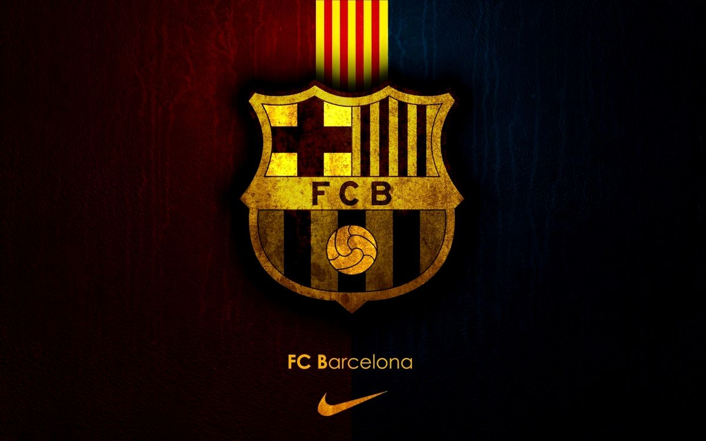

# 🔵🔴 FC Barcelona Scouting Dashboard ⚽



A **modern football scouting dashboard** built to analyze players through the lens of **FC Barcelona’s identity and playing philosophy**.  
This project blends **data analytics, visual storytelling, and football intelligence** to help explore player profiles, compare performance, and support smarter recruitment decisions.

---

## 🌟 Why This Project Matters

### 🔍 For Scouts & Analysts
- Evaluate players using **data-driven insights** instead of relying only on eye test.
- Identify profiles that fit **Barcelona’s tactical and technical style**.
- Compare players across multiple roles and attributes with clarity.
- Support recruitment decisions with **structured scouting metrics**.

### 🏟️ For Clubs & Decision Makers
- Reduce transfer uncertainty by highlighting **strengths, weaknesses, and role fit**.
- Discover players who align with long-term squad planning.
- Use analytics to support decisions in **recruitment, squad depth, and future development**.
- Turn raw football data into **actionable scouting intelligence**.

### 👥 For Football Fans & Data Enthusiasts
- Explore how modern football analytics can be used in player scouting.
- Understand what makes a player suitable for a club like **FC Barcelona**.
- Interact with football data in a more visual, engaging, and practical way.
- See how dashboards can transform football analysis into a real decision-support tool.

---

## ✨ Features & Highlights

| Feature | Description |
|---------|-------------|
| 📊 Player Scouting Dashboard | Analyze players through interactive visual insights and role-based evaluation. |
| 🔵🔴 Barcelona-Themed Design | Custom UI inspired by FC Barcelona’s identity for a more immersive experience. |
| 🧠 Smart Role Analysis | Explore player suitability across different positions and tactical roles. |
| 📈 Performance Comparison | Compare players using key technical, physical, and tactical attributes. |
| 🎨 Rich Visual Experience | Includes player images, themed assets, and modern presentation elements. |
| ⚽ Football Decision Support | Helps translate raw player data into scouting and recruitment insights. |

---

## 🚀 How to Use This App

### 1) Prerequisites
- Python 3.9+
- Project files and datasets included in the repository

### 2) Clone the Repository
```bash
git clone https://github.com/YOUR-USERNAME/YOUR-REPOSITORY.git
cd YOUR-REPOSITORY
Technical Details
Framework: Streamlit
Language: Python
Data Handling: pandas, numpy
Visualization: Interactive dashboard components for player analysis
Assets: Club-themed visuals, player images, and supporting media
Use Case: Football scouting, player comparison, recruitment support, and sports analytics presentation
📊 Project Value

This project shows how sports analytics can be transformed into a practical scouting tool.
Instead of viewing player data as isolated numbers, the dashboard organizes information in a way that supports:

smarter player evaluation
clearer tactical fit analysis
more professional football presentation
better recruitment storytelling through data

It demonstrates the value of combining football knowledge, analytics, and modern dashboard design into one powerful application.

📞 Contact & Portfolio

Connect or check out my work:

🌐 Portfolio: mohamed-ashraf-github-io.vercel.app
🔗 LinkedIn: linkedin.com/in/mohamed--ashraff
🐙 GitHub: github.com/MohamedAshraf-DE
Freelance Accounts
💼 Upwork: Upwork Profile
💼 Mostaql: Mostaql Profile
💼 Khamsat: Khamsat Profile
💼 Freelancer: Freelancer Dashboard
💼 Outlier: Outlier Profile
